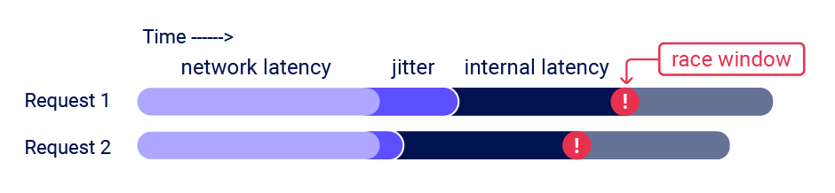

# Race Condition Vulnerability
## Application description
Vulnerable demo application allows to rate teachers from 1 to 5. User is allowed to rate each teacher only once.
Application checks if a given review exists before submitting a new one:
```java
rankingRepository.findOneByReviewerIdAndTeacherId(teacherRankingRequest.reviewerId(), teacherRankingRequest.teacherId())
        .ifPresent(t -> {
            throw new TeacherRankingExistsException(teacherRankingRequest.reviewerId(), teacherRankingRequest.teacherId());
        });
```

## Running locally
```shell
make start
```
or
```shell
./gradlew clean build && docker-compose up --build
```
It starts two Docker containers:
* Vulnerable Java web application (available at https://localhost:8443),
* Postgres database. It resets stored data with each restart to defaults (two teachers, each with one 5 score).

### Secure connection
Please note `https://` scheme. HTTP/ RFC does not enforce using TLS but in practice, vast majority of HTTP/2 clients support only secure connections.
This project uses self-signed certificate which is present in this GIT repository, together with password. It will not be trusted by any browser.
It is not advised to add it to browser's permanent trust store locally.

## Vulnerability description
If requests are sent quickly enough, more than one rating from the same user for a given teacher will be saved due to race condition.

source: https://portswigger.net/research/the-single-packet-attack-making-remote-race-conditions-local

HTTP/2 allows sending multiple requests in one TCP connection. This makes grouping incomplete requests on server side possible before processing them.
Issuing final fragment of each request in a single TCP packet will trigger processing all of them simultaneously by the server.
This makes race condition much more likely by eliminating network jitter.


source: https://portswigger.net/research/the-single-packet-attack-making-remote-race-conditions-local

## Vulnerability exploitation
Send multiple requests quickly to add a review for a particular teacher. You can use Burp Suite or other tool. Example:

```http request
POST /api/v1/teachers HTTP/2
Host: localhost:8443
Content-Type: application/json
Accept: */*

{"reviewerId":"c884000b-2333-4960-8be1-8bd9c11f1da9","teacherId":"1b423302-3371-477c-87e7-19c25beb4bd6","score":1,"comment":"Terrible experience!!!","date":"2025-05-08T08:59:49.672Z"}
```

## Possible fixes
* Adding `UNIQUE (REVIEWER_ID, TEACHER_ID)` constrain in data model,
* Synchronizing `addTeacherRanking(...)` method per user,
* Using `@Transactional(isolation = Isolation.SERIALIZABLE)` on top of the `addTeacherRanking(...)` method. This will cause performance hit.
